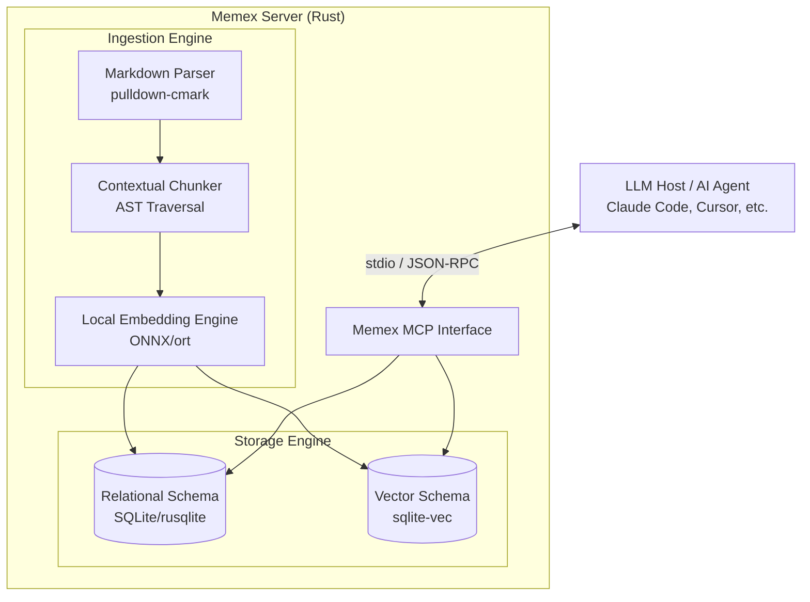

# Memex

> **Local, Offline Documentation Context Server (MCP) for LLMs & AI Coding Agents**

[](#memex)
[](LICENSE)
[](#-testing--benchmarks)

**Memex** is a high-performance, 100% offline [Model Context Protocol (MCP)](https://modelcontextprotocol.io/) server written in Rust. It serves as a semantic and structural gateway to project documentation, drastically reducing token consumption, context window pollution, and query latency for AI assistants like Claude Code, Cursor, and Antigravity IDE.

> [!NOTE]
> **MVP Complete & Ready for Use:** All 10 development phases and 47 core specification tasks are 100% implemented, tested, and benchmarked. You can build the standalone binary and start indexing repositories immediately.

---

## ⚡ Key Features

- **🔒 100% Offline & Private:** Zero external API calls. Everything runs locally using an embedded ONNX runtime (`all-MiniLM-L6-v2`) and embedded SQLite vector search (`sqlite-vec`).
- **📉 70-95% Token Reduction:** Instead of dumping whole documentation files into the LLM context, Memex returns concise, highly relevant semantic chunks with hierarchical context.
- **🧭 Contextual Prefixing & Graph Hierarchy:** Parses Markdown into an AST and prepends ancestor heading trails (e.g. `[API > Auth > OAuth2]`) to chunks, preserving structural meaning and enabling graph traversal.
- **⚡ Blazing Fast Incremental Sync:** Uses content hashes and timestamps to update modified documentation in milliseconds, making it seamless to run in Git hooks.
- **📦 Single Self-Contained Binary:** Zero runtime dependencies. Easy installation and agent configuration across tools.

---

## 🚀 Quick Start

### 1. Fast Installation (Pre-built Binaries)

No Rust toolchain required. Install the latest official binary for your platform:

**macOS (Apple Silicon) & Linux:**
```bash
curl -fsSL https://raw.githubusercontent.com/garnizeh/memex/main/install.sh | sh
```

**Windows (PowerShell):**
```powershell
irm https://raw.githubusercontent.com/garnizeh/memex/main/install.ps1 | iex
```

*(Alternatively, build from source via `cargo install --path .` or `cargo build --release`)*

### 2. Auto-Register with AI Agents

Automatically detect and configure Memex MCP across your local AI agents (Claude Code, Cursor, Antigravity IDE):

```bash
memex install
```

### 3. Initialize Documentation Index

Inside your project root:

```bash
memex init
```

This creates the local `.memex/` directory, parses all Markdown files, generates local embeddings, and prepares the SQLite graph database (`.memex/memex.db`).

### 4. Incremental Indexing

Update the index after modifying or adding Markdown documentation:

```bash
memex index
```

### 5. Git Hooks Automation (Optional)

Automatically keep your documentation index up to date whenever you commit, merge, or checkout:

```bash
make install-hooks
# or directly:
./scripts/install-git-hooks.sh
```

---

## 🛠️ MCP Server Interface

When started as an MCP server (`memex serve --mcp`), Memex exposes two primary tools to AI agents:

1. **`search_documentation(query: string, limit: int)`**
   - Performs dense vector similarity search (KNN via `sqlite-vec`) across chunk embeddings.
   - Returns top relevant chunks with source file paths, line numbers, and hierarchical heading prefixes.

2. **`traverse_graph(chunk_id: string, depth: int)`**
   - Expands surrounding context around a specific chunk.
   - Traverses parent headings upward and child sections / explicitly linked markdown references downward.

---

## 🏗️ Architecture

For a deep dive into data structures, database schema, SQLite queries, parsing pipelines, and benchmark validation gates, check out the comprehensive [Architecture Design Document](docs/architecture.md).



---

## ⚙️ Project Configuration (`memex.json`)

You can customize inclusion and exclusion rules at the project level by committing a `memex.json` in your repository root:

```json
{
  "exclude": [
    "vendor/",
    "docs/legacy/"
  ],
  "include": [
    "docs/"
  ]
}
```

---

## 🧪 Testing & Benchmarks

Run tests and benchmarks:

```bash
# Run unit & integration tests
cargo test

# Run efficiency benchmarks
cargo bench

# Run empirical real-world benchmark against repository docs
cargo bench --bench run_empirical_benchmark

# Run CI token efficiency gate (ensures >= 70% token reduction)
cargo test --test test_token_reduction_gate -- --ignored
```

📊 **Empirical Performance Report:** Check out [`docs/benchmark-report.md`](docs/benchmark-report.md) for the full empirical benchmark analysis proving **98.19% token reduction** and **~38ms average query latency** measured on this repository.

---

## 📄 License

This project is licensed under the [MIT License](LICENSE).
