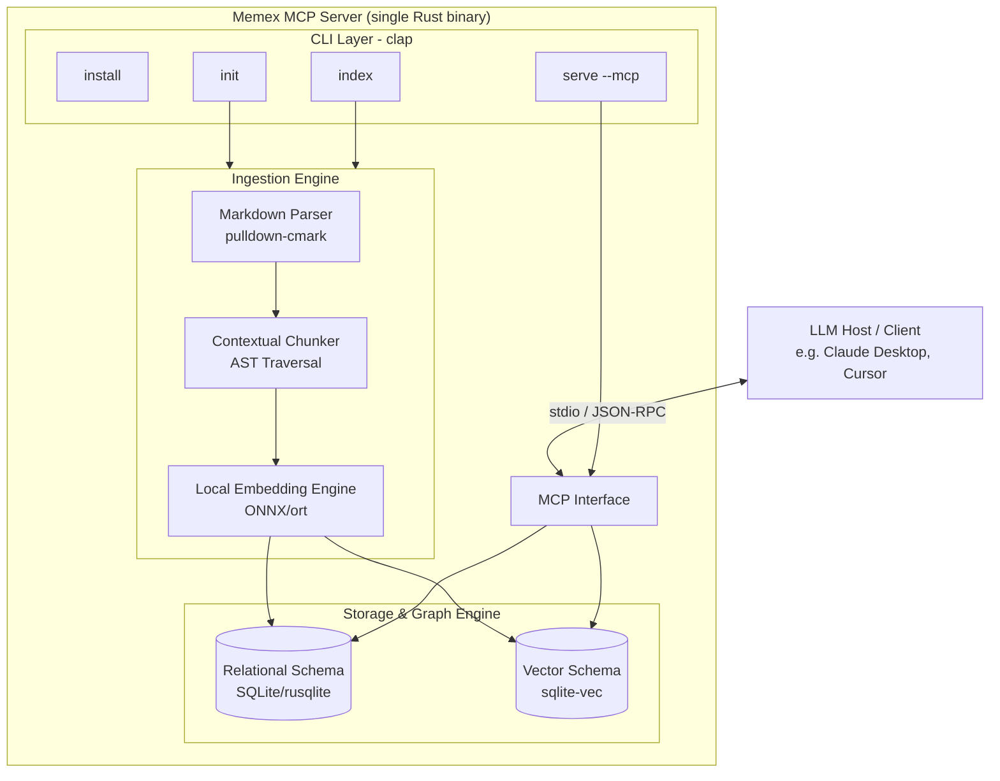
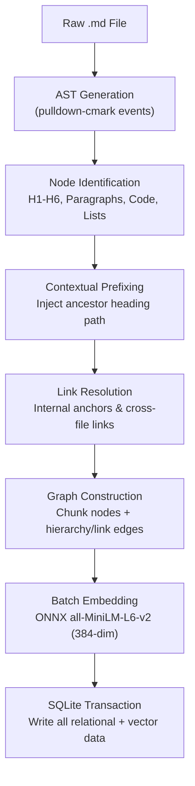
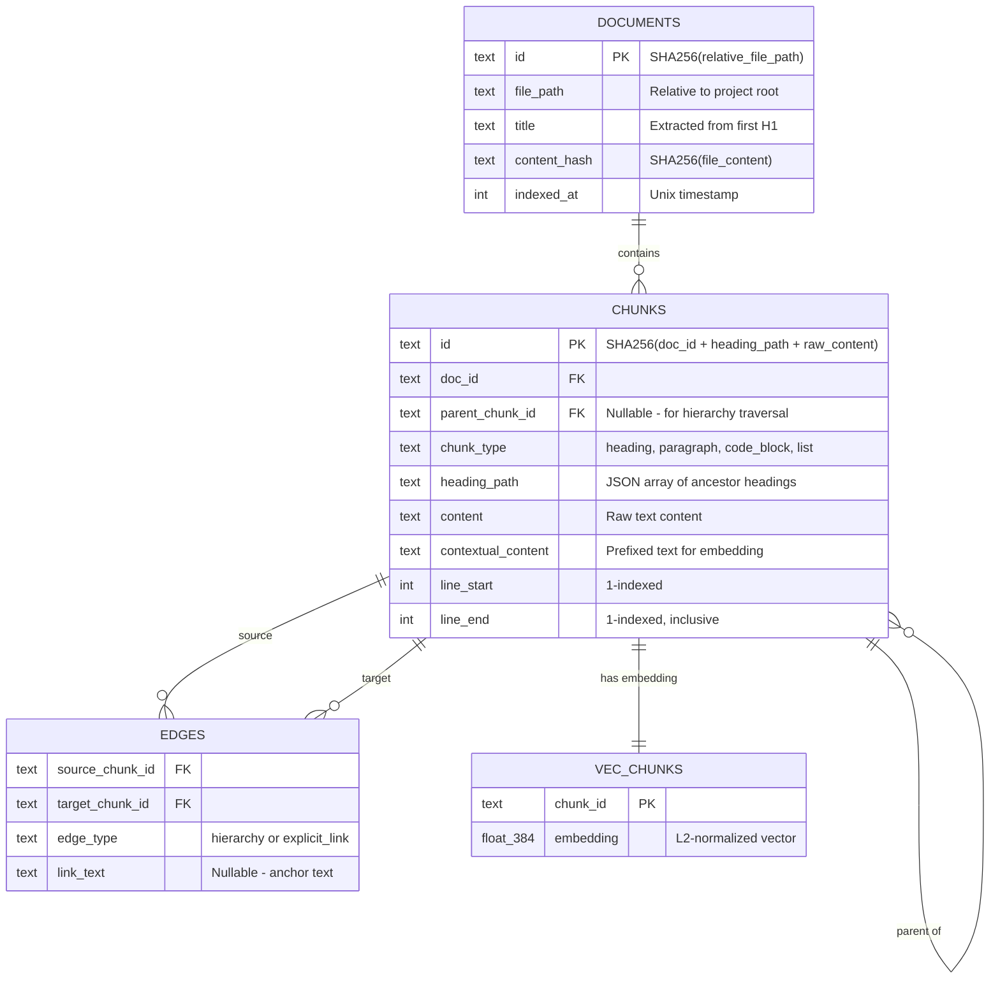
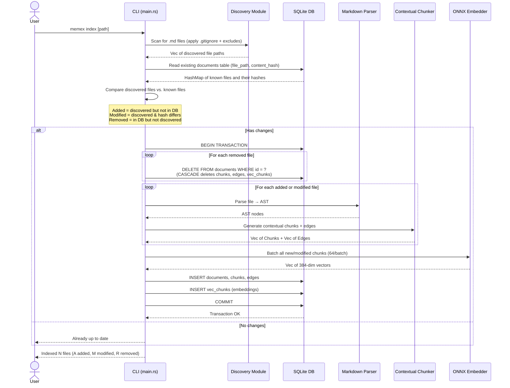
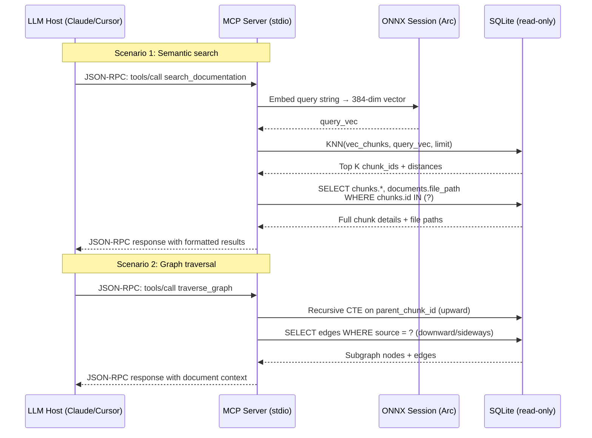
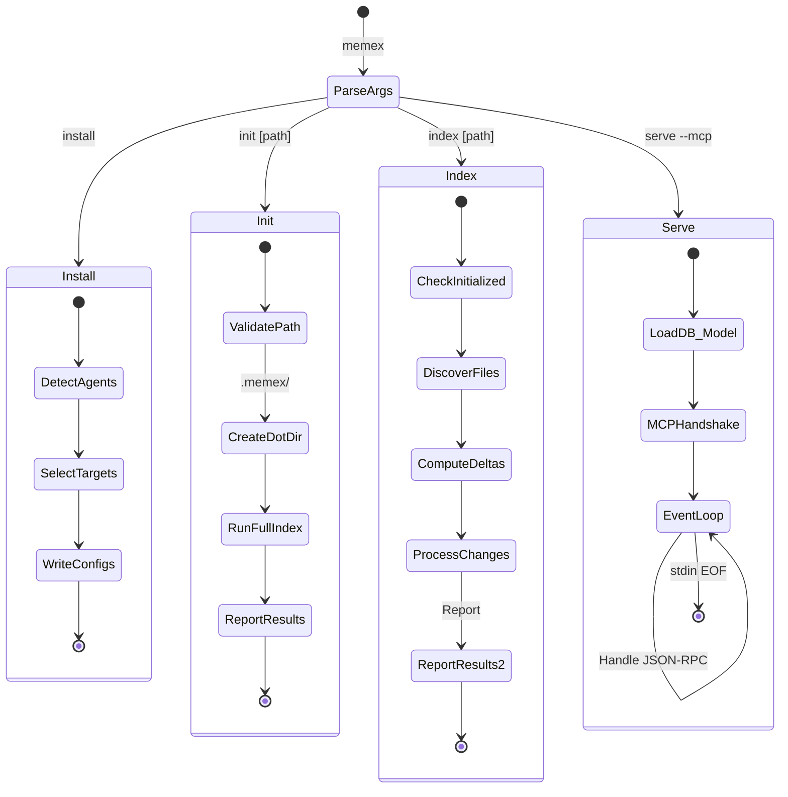

# Architecture Design Document (ADD)
**Project:** Memex (Local Offline Documentation Context Server)  
**Role:** Principal Software Architect  
**Status:** Draft / MVP Scope  
**Target Audience:** Rust Engineering Team  
**Last Updated:** 2026-08-28  

---

## 1. Executive Summary

Large Language Models (LLMs) suffer from context window pollution, high token costs, and potential privacy concerns when ingesting large codebases or entire documentation repositories. **Memex** is a local, entirely offline Model Context Protocol (MCP) server written in Rust designed to solve this by acting as a semantic and structural gateway to project documentation. 

Instead of feeding entire documents or naive text chunks into the LLM, Memex parses Markdown documentation into a semantic graph, embeds the chunks locally, and stores them in an embedded SQLite database. When an LLM needs information, it queries the MCP server. The server performs a vector similarity search to find relevant chunks, then traverses the graph to retrieve structural context (parent headings, linked concepts). This ensures the LLM receives only the highly relevant, contextually rich information it needs, drastically reducing token consumption while maintaining 100% offline privacy and zero external API dependencies.

### 1.1. Core Design Principles
1.  **100% Offline:** No network requests, ever. The embedding model is bundled or cached locally. All data stays on the user's machine.
2.  **Single Binary:** The entire system (CLI, MCP server, embedding engine, database) ships as a single Rust binary with zero runtime dependencies.
3.  **Minimal Footprint:** The `.memex/` data directory is self-contained and `.gitignore`-able. Removing it completely uninitializes the project.
4.  **Idempotent Operations:** Running `init` or `index` multiple times produces the exact same result. Partial failures never leave the database in a corrupted state.
5.  **Agent-Agnostic:** The MCP interface works with any compliant host (Claude Code, Cursor, Antigravity IDE, etc.) via the standard stdio JSON-RPC transport.

---

## 2. System Architecture Overview

The system is composed of four primary subsystems operating within a single highly optimized Rust binary. This monolithic architecture simplifies distribution and ensures minimal latency between components.



### 2.1. Components Breakdown

| Component | Responsibility | Key Crate |
| :--- | :--- | :--- |
| **CLI Layer** | Parses user commands (`install`, `init`, `index`, `serve`), validates arguments, orchestrates workflows. | `clap` |
| **MCP Interface** | Handles stdio JSON-RPC 2.0 communication. Parses requests, routes to handlers, serializes responses. Runs as a long-lived process. | `mcp-rust-sdk` / `rmcp` |
| **Ingestion Engine** | Parses Markdown → AST → Contextual Chunks → Embeddings. The core transformation pipeline. | `pulldown-cmark`, `ort` |
| **Storage & Graph Engine** | Manages the SQLite database. Writes relational graph data + vector embeddings. Executes KNN queries. | `rusqlite`, `sqlite-vec` |

---

## 3. Rust Module Structure

The binary is organized into the following module hierarchy. Each module has a single, clearly defined responsibility.

```
src/
├── main.rs                  # Entry point. Parses CLI args via clap, dispatches to commands.
├── cli/
│   ├── mod.rs               # Re-exports all CLI command handlers.
│   ├── install.rs           # `memex install` — agent detection & config writing.
│   ├── init.rs              # `memex init`    — scaffolding + full initial index.
│   ├── index.rs             # `memex index`   — incremental re-index.
│   └── serve.rs             # `memex serve`   — starts the MCP stdio server loop.
├── ingestion/
│   ├── mod.rs               # Re-exports the pipeline.
│   ├── parser.rs            # pulldown-cmark event stream → custom AST nodes.
│   ├── chunker.rs           # AST → contextual chunks with prefix injection.
│   └── embedder.rs          # Batched ONNX embedding generation via `ort`.
├── storage/
│   ├── mod.rs               # Re-exports DB handle and operations.
│   ├── db.rs                # SQLite connection management, migrations, WAL setup.
│   ├── schema.rs            # CREATE TABLE / CREATE INDEX / CREATE VIRTUAL TABLE statements.
│   ├── writer.rs            # Transactional insert of documents, chunks, edges, vectors.
│   └── reader.rs            # KNN search, graph traversal queries, metadata lookups.
├── mcp/
│   ├── mod.rs               # MCP server setup, tool registration.
│   ├── transport.rs         # stdio read/write loop, JSON-RPC framing.
│   ├── tools.rs             # Tool handler implementations (search_documentation, traverse_graph).
│   └── types.rs             # Request/response serde structs for MCP protocol.
├── discovery/
│   ├── mod.rs               # File discovery and filtering logic.
│   ├── walker.rs            # Recursive directory scanning with ignore rules.
│   └── gitignore.rs         # .gitignore parser and matcher.
├── installer/
│   ├── mod.rs               # Orchestrates multi-agent install flow.
│   ├── targets/
│   │   ├── mod.rs           # Target registry and detection.
│   │   ├── claude.rs        # Claude Code: ~/.claude.json, settings.json, CLAUDE.md
│   │   ├── cursor.rs        # Cursor: mcp.json config injection.
│   │   └── types.rs         # AgentTarget trait, DetectionResult, InstallOptions.
│   └── config_writer.rs     # Atomic JSON/TOML file write helpers.
├── config.rs                # Project-level memex.json parsing (exclude, include patterns).
├── errors.rs                # Custom error types via thiserror.
└── models.rs                # Core domain structs: Document, Chunk, Edge, ChunkType.
```

### 3.1. Core Domain Structs (`models.rs`)

These are the fundamental data structures that flow through the entire system:

```rust
use serde::{Deserialize, Serialize};

/// A discovered and indexed Markdown document.
#[derive(Debug, Clone, Serialize, Deserialize)]
pub struct Document {
    pub id: String,             // SHA256(file_path relative to project root)
    pub file_path: String,      // Relative path from project root (e.g., "docs/api.md")
    pub title: Option<String>,  // Extracted from first H1, if present
    pub content_hash: String,   // SHA256(file_content) — for incremental indexing
    pub indexed_at: i64,        // Unix timestamp (seconds)
}

/// The type of semantic unit a chunk represents.
#[derive(Debug, Clone, PartialEq, Serialize, Deserialize)]
pub enum ChunkType {
    Heading { level: u8 },  // H1–H6, with the heading level preserved
    Paragraph,
    CodeBlock { language: Option<String> },
    List,
}

/// A contextually-enriched chunk of documentation.
#[derive(Debug, Clone, Serialize, Deserialize)]
pub struct Chunk {
    pub id: String,                     // SHA256(doc_id + heading_path + raw_content)
    pub doc_id: String,                 // FK → Document.id
    pub parent_chunk_id: Option<String>,// FK → Chunk.id (for hierarchical traversal)
    pub chunk_type: ChunkType,
    pub heading_path: Vec<String>,      // e.g., ["API Reference", "Authentication", "OAuth2"]
    pub content: String,                // The raw text content of this chunk
    pub contextual_content: String,     // "[API Reference > Authentication > OAuth2] The client..."
    pub line_start: u32,                // 1-indexed line number in the source file
    pub line_end: u32,                  // 1-indexed, inclusive
}

/// An edge in the documentation graph.
#[derive(Debug, Clone, Serialize, Deserialize)]
pub struct Edge {
    pub source_chunk_id: String,
    pub target_chunk_id: String,
    pub edge_type: EdgeType,
    pub link_text: Option<String>,  // The anchor text if edge_type is ExplicitLink
}

#[derive(Debug, Clone, PartialEq, Serialize, Deserialize)]
pub enum EdgeType {
    Hierarchy,      // Parent heading → child content
    ExplicitLink,   // Markdown [text](url) resolved to another chunk
}
```

---

## 4. Ingestion & Parsing Pipeline

The ingestion pipeline transforms raw Markdown files into a semantically rich graph structure. It goes beyond simple text splitting by understanding the structural hierarchy of the documentation.



### 4.1. AST Generation (`ingestion/parser.rs`)

We utilize `pulldown-cmark` to parse `.md` files into an Event stream, which we compile into a custom Abstract Syntax Tree (AST). This allows us to understand document structure rather than just raw text.

**Implementation Detail:**
`pulldown-cmark` emits a flat stream of `Event` variants (`Start(Tag)`, `End(Tag)`, `Text(CowStr)`, `Code(CowStr)`, etc.). The parser module must maintain a stack of open tags to reconstruct the tree. When a `Start(Heading(level))` event arrives, it is pushed onto the stack; all subsequent text events become children of that heading until the matching `End(Heading)` is received.

**Key Decision — Source Line Tracking:**
Enable `pulldown-cmark`'s `Options::enable_source_mapping()` (or use the `offset` on events) to track byte offsets. These are converted to line numbers so that the MCP response can report the exact source location of each chunk, enabling the LLM to generate precise file references.

### 4.2. Contextual Chunking Strategy (`ingestion/chunker.rs`)

Naive chunking (e.g., splitting by 512 tokens) destroys context. A paragraph explaining "authentication" loses its meaning if separated from its parent heading describing the specific API endpoint. We implement **Contextual Prefixing**:

1.  **Node Identification:** The AST is traversed to identify distinct semantic units: Headings (H1-H6), Paragraphs, Lists, and Code Blocks.
2.  **Heading Path Construction:** For every leaf node (paragraph, list item, or code block), traverse up the AST to collect all ancestor headings into a `Vec<String>` called `heading_path`.
3.  **Prefix Injection:** The `contextual_content` field is generated by prepending the heading path:
    *   *Input:* A paragraph with `heading_path: ["API Reference", "Authentication", "OAuth2"]` and `content: "The client must send a Bearer token..."`
    *   *Output:* `contextual_content: "[API Reference > Authentication > OAuth2] The client must send a Bearer token..."`
    *   *Why:* This ensures the embedding vector captures the exact semantic scope of the text, vastly improving retrieval accuracy and eliminating ambiguity.

4.  **Chunk Size Guardrail:** If a single chunk's `contextual_content` exceeds ~512 tokens (~2000 chars), it is split at sentence boundaries. Each sub-chunk retains the same `heading_path` prefix and shares the same `parent_chunk_id`. The `all-MiniLM-L6-v2` model has a max input of 256 tokens; inputs beyond this are truncated by the tokenizer, so splitting preserves embedding quality.

### 4.3. Graph Construction

*   **Nodes:** Each contextual chunk becomes a Node in the graph (a row in `chunks`).
*   **Edges (Hierarchy):** When a paragraph is created under `### OAuth2`, an edge of type `Hierarchy` is inserted from the `OAuth2` heading chunk to the paragraph chunk. This allows upward traversal to reconstruct the full document tree around any leaf node.
*   **Edges (Explicit Link):** Markdown links (`[text](url)`) are parsed:
    *   **Internal anchors** (`#section-name`): resolved to the chunk whose heading text matches after slugification.
    *   **Cross-file links** (`../api/auth.md#oauth2`): resolved to the matching chunk in the target document, if it has been indexed.
    *   **External URLs** (`https://...`): stored as metadata on the chunk but do not create edges.

### 4.4. Embedding Generation (`ingestion/embedder.rs`)

*   **Model:** `all-MiniLM-L6-v2` (~80MB ONNX file), producing 384-dimensional `f32` vectors.
*   **Batching:** Chunks are collected into batches (default: 64). Each batch is tokenized and passed through the ONNX model in a single `session.run()` call. This is critical for throughput: batching amortizes the per-invocation overhead of `ort`.
*   **Session Reuse:** The `ort::Session` is created once at startup and held in an `Arc<Session>`. It is never re-created between batches or between CLI invocations (within the same process, e.g., `serve` mode).
*   **Normalization:** The raw output vectors are L2-normalized before storage, so cosine similarity reduces to a simple dot product at query time.

```rust
// Pseudocode for the embedding pipeline
fn embed_batch(session: &ort::Session, texts: &[String]) -> Vec<[f32; 384]> {
    let tokenized = tokenize_batch(texts);  // BPE tokenization
    let input_ids = tokenized.input_ids;     // shape: [batch_size, seq_len]
    let attention_mask = tokenized.attention_mask;
    
    let outputs = session.run(ort::inputs! {
        "input_ids" => input_ids,
        "attention_mask" => attention_mask,
    }).unwrap();
    
    let embeddings = outputs["last_hidden_state"];
    mean_pool_and_normalize(embeddings, &attention_mask)
}
```

---

## 5. Database Schema

The database uses SQLite with WAL mode. We separate the structural graph data into standard relational tables and the vector data into a `sqlite-vec` virtual table. This allows us to combine the power of SQL joins with fast vector similarity search.



### 5.1. SQL Definitions (`storage/schema.rs`)

```sql
-- Pragmas set on every connection open
PRAGMA journal_mode = WAL;          -- Write-Ahead Logging for concurrent reads
PRAGMA synchronous = NORMAL;        -- Balanced durability/performance
PRAGMA foreign_keys = ON;           -- Enforce FK constraints
PRAGMA cache_size = -64000;         -- 64MB page cache

-- ==========================================================================
-- 1. Relational Tables (The Graph)
-- ==========================================================================

CREATE TABLE IF NOT EXISTS documents (
    id TEXT PRIMARY KEY,
    file_path TEXT NOT NULL UNIQUE,
    title TEXT,
    content_hash TEXT NOT NULL,      -- For incremental indexing
    indexed_at INTEGER NOT NULL
);

CREATE TABLE IF NOT EXISTS chunks (
    id TEXT PRIMARY KEY,
    doc_id TEXT NOT NULL,
    parent_chunk_id TEXT,
    chunk_type TEXT NOT NULL,        -- 'heading:1'..'heading:6', 'paragraph', 'code_block', 'list'
    heading_path TEXT NOT NULL,      -- JSON: ["API Reference", "Auth", "OAuth2"]
    content TEXT NOT NULL,           -- Raw text
    contextual_content TEXT NOT NULL,-- Prefixed text (used for embedding)
    line_start INTEGER NOT NULL,
    line_end INTEGER NOT NULL,
    FOREIGN KEY (doc_id) REFERENCES documents(id) ON DELETE CASCADE,
    FOREIGN KEY (parent_chunk_id) REFERENCES chunks(id) ON DELETE SET NULL
);

CREATE TABLE IF NOT EXISTS edges (
    source_chunk_id TEXT NOT NULL,
    target_chunk_id TEXT NOT NULL,
    edge_type TEXT NOT NULL,         -- 'hierarchy' or 'explicit_link'
    link_text TEXT,
    PRIMARY KEY (source_chunk_id, target_chunk_id, edge_type),
    FOREIGN KEY (source_chunk_id) REFERENCES chunks(id) ON DELETE CASCADE,
    FOREIGN KEY (target_chunk_id) REFERENCES chunks(id) ON DELETE CASCADE
);

-- Indices for fast graph traversal
CREATE INDEX IF NOT EXISTS idx_chunks_doc ON chunks(doc_id);
CREATE INDEX IF NOT EXISTS idx_chunks_parent ON chunks(parent_chunk_id);
CREATE INDEX IF NOT EXISTS idx_chunks_type ON chunks(chunk_type);
CREATE INDEX IF NOT EXISTS idx_edges_target ON edges(target_chunk_id);
CREATE INDEX IF NOT EXISTS idx_edges_type ON edges(edge_type);

-- ==========================================================================
-- 2. Vector Tables (sqlite-vec)
-- ==========================================================================

-- all-MiniLM-L6-v2 outputs 384 dimensions
CREATE VIRTUAL TABLE IF NOT EXISTS vec_chunks USING vec0(
    chunk_id TEXT PRIMARY KEY,
    embedding FLOAT[384]
);
```

### 5.2. Database Location

The database file is stored at `<project_root>/.memex/memex.db`. The `.memex/` directory also contains:
*   `memex.db-wal` — SQLite WAL file (auto-managed).
*   `memex.db-shm` — SQLite shared memory file (auto-managed).
*   `errors.log` — Per-file indexing errors from the last run (optional).

The entire `.memex/` directory should be added to `.gitignore`.

---

## 6. Data Flow — Indexing Phase

When the user executes `memex index ./docs`, the system processes the documentation directory to build or update the local database.



### 6.1. File Discovery Algorithm (`discovery/walker.rs`)

The discovery module must reliably find all target Markdown files while respecting user preferences:

1.  **Recursive Walk:** Starting from the target path (default: project root), recursively list directory entries.
2.  **Built-in Ignores:** Always skip:
    *   Hidden directories (starting with `.`) except the target path itself.
    *   `node_modules/`, `target/`, `dist/`, `build/`, `.git/`, `vendor/`.
    *   The `.memex/` directory itself.
3.  **`.gitignore` Parsing:** If a `.gitignore` exists in the project root (or any subdirectory), parse it and apply its rules to filter out matching paths. Use the `ignore` crate for this.
4.  **Project Config Excludes:** If `memex.json` exists in the project root (see Section 10), apply its `exclude` patterns as additional filters.
5.  **File Extension Filter:** Only collect files ending in `.md` or `.markdown` (case-insensitive).

### 6.2. Incremental Indexing Strategy

To avoid re-processing unchanged files, the `documents` table stores a `content_hash` (SHA256 of the file's bytes). On each `index` run:

1.  **Read all discovered file paths and compute their SHA256 hashes.**
2.  **Query the `documents` table for all stored `(file_path, content_hash)` pairs.**
3.  **Classify:**
    *   `Added`: file exists on disk but not in the DB.
    *   `Modified`: file exists in both, but `content_hash` differs.
    *   `Removed`: file exists in the DB but not on disk.
    *   `Unchanged`: file exists in both, `content_hash` matches → **skip**.
4.  **For `Removed` files:** `DELETE FROM documents WHERE id = ?`. The `ON DELETE CASCADE` foreign keys automatically remove all associated chunks, edges, and vector entries.
5.  **For `Modified` files:** Delete the old document (cascading), then re-insert it as if it were new.
6.  **For `Added` files:** Parse, chunk, embed, and insert.

This strategy ensures that re-indexing a 500-file project where only 3 files changed processes only those 3 files.

### 6.3. Indexing Optimizations

*   **Batching:** Embedding generation is batched to saturate CPU cores via `ort`. Default batch size: 64 chunks.
*   **Single Transaction:** All database writes (deletes + inserts) are wrapped in a single `BEGIN ... COMMIT` transaction. This is critical for SQLite performance; without it, each INSERT would trigger a separate fsync.
*   **Error Isolation:** If a single file fails to parse, log the error and continue with the remaining files. Never abort the entire transaction due to one bad file. Write errors to `.memex/errors.log`.

---

## 7. Data Flow — Query Phase (MCP)

The MCP server runs as a long-lived process started by `memex serve --mcp`, communicating via JSON-RPC 2.0 over stdio. It exposes two primary tools to the LLM.



### 7.1. MCP Server Lifecycle (`cli/serve.rs`)

1.  **Startup:** Open the SQLite database in read-only mode (`SQLITE_OPEN_READ_ONLY`). Load the ONNX model into an `Arc<ort::Session>`.
2.  **Handshake:** Respond to the MCP `initialize` request with server capabilities (tools list, server info).
3.  **Event Loop:** Read JSON-RPC messages line-by-line from stdin. Dispatch to the appropriate tool handler. Write JSON-RPC responses to stdout.
4.  **Shutdown:** On stdin EOF or a `shutdown` request, close the database and exit cleanly.

**Critical:** The MCP server must **never** write to stdout except for valid JSON-RPC messages. All logs, warnings, and diagnostics go to **stderr**.

### 7.2. Tool 1: `search_documentation`

**MCP Tool Definition (sent during `initialize`):**
```json
{
  "name": "search_documentation",
  "description": "Search the project's Markdown documentation using semantic similarity. Returns the most relevant documentation chunks with their source file, heading context, and line numbers.",
  "inputSchema": {
    "type": "object",
    "properties": {
      "query": {
        "type": "string",
        "description": "Natural language search query describing what documentation you need."
      },
      "limit": {
        "type": "integer",
        "description": "Maximum number of results to return (default: 5, max: 20).",
        "default": 5
      }
    },
    "required": ["query"]
  }
}
```

**Handler Logic:**
1.  Embed the `query` string using the same ONNX session used during indexing.
2.  Execute the KNN query against `vec_chunks`:
    ```sql
    SELECT chunk_id, distance
    FROM vec_chunks
    WHERE embedding MATCH ?1
    ORDER BY distance
    LIMIT ?2
    ```
3.  For each result, join with `chunks` and `documents` to assemble the full response.
4.  Return formatted results including: `file_path`, `heading_path`, `content`, `line_start`, `line_end`, `similarity_score`.

**Example Response Content (text returned to LLM):**
```
## Results for: "how does OAuth2 authentication work"

### 1. docs/api/auth.md > Authentication > OAuth2 (lines 45-67, score: 0.89)
The client must send a Bearer token in the Authorization header. Tokens are obtained
via the /oauth/token endpoint using client credentials...

### 2. docs/api/auth.md > Authentication > Token Refresh (lines 70-85, score: 0.76)
Access tokens expire after 3600 seconds. Use the refresh token to obtain a new...
```

### 7.3. Tool 2: `traverse_graph`

**MCP Tool Definition:**
```json
{
  "name": "traverse_graph",
  "description": "Retrieve surrounding documentation context for a specific chunk. Traverses the document graph upward (to parent headings) and downward/sideways (to child sections and linked content).",
  "inputSchema": {
    "type": "object",
    "properties": {
      "chunk_id": {
        "type": "string",
        "description": "The ID of the chunk to expand context around (obtained from search_documentation results)."
      },
      "depth": {
        "type": "integer",
        "description": "How many levels of the graph to traverse (default: 2, max: 5).",
        "default": 2
      }
    },
    "required": ["chunk_id"]
  }
}
```

**Handler Logic:**
1.  **Upward Traversal:** Use a recursive CTE to walk `parent_chunk_id` up to `depth` levels:
    ```sql
    WITH RECURSIVE ancestors(id, depth) AS (
        SELECT parent_chunk_id, 1 FROM chunks WHERE id = ?1
        UNION ALL
        SELECT c.parent_chunk_id, a.depth + 1
        FROM chunks c JOIN ancestors a ON c.id = a.id
        WHERE a.depth < ?2 AND c.parent_chunk_id IS NOT NULL
    )
    SELECT chunks.* FROM chunks JOIN ancestors ON chunks.id = ancestors.id;
    ```
2.  **Downward/Sideways Traversal:** Query the `edges` table for child chunks and explicit links:
    ```sql
    SELECT chunks.* FROM edges
    JOIN chunks ON chunks.id = edges.target_chunk_id
    WHERE edges.source_chunk_id = ?1;
    ```
3.  Return the localized subgraph as a hierarchical document excerpt.

---

## 8. Command-Line Interface (CLI) — MVP Commands

The CLI is the user's primary interface. It uses `clap` with derive macros for argument parsing. Each command is implemented as a separate module in `src/cli/`.



### 8.1. `memex install`

**Purpose:** Interactively wire Memex as an MCP server into the user's AI coding agents.

**Detailed Implementation:**

1.  **Agent Detection:** For each supported agent, check if its configuration directory or binary exists on the system:

    | Agent | Detection Method | Config File to Write |
    | :--- | :--- | :--- |
    | **Claude Code** | `~/.claude/` exists or `~/.claude.json` exists | `~/.claude.json` (global) or `.mcp.json` (local) |
    | **Cursor** | `~/.cursor/` exists | `~/.cursor/mcp.json` |
    | **Antigravity IDE** | `~/.gemini/` exists | MCP config per IDE spec |

2.  **MCP Server Config Block:** The JSON snippet injected into the agent's config file:
    ```json
    {
      "mcpServers": {
        "memex": {
          "type": "stdio",
          "command": "memex",
          "args": ["serve", "--mcp"]
        }
      }
    }
    ```
    The installer must **merge** this into the existing config, not overwrite the file. Use read-modify-write with an atomic write (write to `.tmp.PID`, then `rename`).

4.  **Permissions & Hooks (Claude Code & Antigravity IDE):**
    *   **Claude Code:** Injects `mcp__memex__*` permissions into `~/.claude/settings.json` and configures `UserPromptSubmit` prompt-hook command (`memex prompt-hook`).
    *   **Antigravity IDE:** Injects `PreInvocation` hook into `hooks.json` to trigger contextual semantic documentation injection on each planner turn.

5.  **Agent Directive Templates (`AGENTS.md`, `CLAUDE.md`, `.cursorrules`, `.windsurfrules`):**
    Static directive templates instruct agents to prefer Memex MCP tools (`search_documentation`, `traverse_graph`) before generic fallback tools (`view_file`, `grep`).

    ```markdown
    <!-- MEMEX_START -->
    ## Documentation Search (Memex)

    In repositories indexed by Memex (a `.memex/` directory exists), reach for the Memex MCP tool `search_documentation` BEFORE using `view_file` or `grep` on markdown documentation to minimize token usage and locate relevant sections instantly.
    <!-- MEMEX_END -->
    ```
    *   **Hook vs Static Directives Alignment:** Dynamic hooks (e.g. Antigravity IDE `PreInvocation` and Claude Code `UserPromptSubmit`) actively inject relevant doc chunks into prompt context turns. Static rule templates provide universal guidance for all agents (Cursor, Windsurf, Zed, generic agents) to reach for MCP tools first, ensuring optimal token efficiency across both hook-enabled and static agent workflows.
    *   **Idempotency & Non-Destructive Preservation:** Custom user guidelines outside the `<!-- MEMEX_START -->` / `<!-- MEMEX_END -->` markers are strictly preserved.

6.  **Idempotency:** Running `install` again updates the config to the latest version without duplicating entries. The installer checks if `mcpServers.memex` already exists and replaces it.


### 8.2. `memex init [path]`

**Purpose:** Initialize Memex in a project directory, create the database, and run the first complete vectorization.

**Detailed Implementation:**

1.  **Path Resolution:** `path` defaults to `cwd()`. Resolve to an absolute path.
2.  **Safety Check:** Call `unsafe_index_root_reason(path)`:
    *   If `path` is `$HOME`, a filesystem root (`/`, `C:\`), or a parent of `$HOME` → print error and exit(1).
    *   Override with `--force`.
3.  **Already Initialized Check:** If `.memex/memex.db` exists → print warning: `"Already initialized. Use 'memex index' to re-index."` and exit(0).
4.  **Scaffolding:** `fs::create_dir_all(path.join(".memex"))`.
5.  **Database Creation:** Open a new SQLite connection to `.memex/memex.db`. Execute all `CREATE TABLE` and `CREATE VIRTUAL TABLE` statements from Section 5.1.
6.  **Full Index:** Run the complete indexing pipeline (Section 6) with no incremental delta — all discovered files are treated as `Added`.
7.  **Report:**
    ```
    ✓ Initialized in /path/to/project
    ✓ Indexed 47 files
      128 nodes, 312 edges in 2.3s
    ```

### 8.3. `memex index [path]`

**Purpose:** Incrementally update the existing index with changes since the last run.

**Detailed Implementation:**

1.  **Path Resolution:** Resolve `path` (default: `cwd()`). Walk up parent directories to find the nearest `.memex/memex.db`. If not found → error: `"Memex not initialized. Run 'memex init' first."`.
2.  **Incremental Pipeline:** Execute the delta-based indexing described in Section 6.2.
3.  **Report:**
    ```
    ✓ Synced 3 changed files
      Added: 1, Modified: 2, Removed: 0 — 12 nodes in 0.4s
    ```
    Or if nothing changed:
    ```
    ℹ Already up to date
    ```

### 8.4. `memex serve --mcp`

**Purpose:** Start the MCP server. This is not meant to be run by the user directly; it is invoked by the AI agent via the MCP config written by `install`.

**Detailed Implementation:**

1.  **Project Resolution:** The `serve` command must know which project to serve. It resolves the project root by walking up from `cwd()` to find `.memex/memex.db`.
2.  **Database Open:** Open SQLite in **read-only** mode. This prevents the MCP server from accidentally corrupting the index while `index` runs in a separate process.
3.  **Model Load:** Load the ONNX model into an `Arc<ort::Session>`.
4.  **MCP Loop:** Enter the stdio event loop (Section 7.1).

---

## 9. Technology Stack

The MVP will be built using the following specific Rust ecosystem crates. The choices emphasize offline capability, speed, and safety.

| Component | Crate / Technology | Version | Justification |
| :--- | :--- | :--- | :--- |
| **Language** | Rust (Edition 2024) | stable | Memory safety, zero-cost abstractions, excellent CLI ecosystem. |
| **MCP Protocol** | `rmcp` | latest | JSON-RPC 2.0 stdio transport with MCP tool definition macros. |
| **Markdown Parsing** | `pulldown-cmark` | 0.11+ | Gold standard for MD in Rust. Event-driven, allows custom AST. |
| **Database** | `rusqlite` (feat: `bundled`) | 0.32+ | Mature SQLite bindings. `bundled` compiles SQLite from source. |
| **Vector Search** | `sqlite-vec` | 0.1+ | Loaded as `rusqlite` extension. KNN search inside SQLite. |
| **Embeddings** | `ort` (ONNX Runtime) | 2.0+ | Runs `all-MiniLM-L6-v2` locally. CPU/GPU. |
| **Async Runtime** | `tokio` | 1.x | For MCP stdio streams and concurrent I/O. |
| **CLI** | `clap` (feat: `derive`) | 4.x | Derive-based arg parsing for clean CLI definition. |
| **Serialization** | `serde`, `serde_json` | 1.x | For MCP protocol, config files, and metadata blobs. |
| **Hashing** | `sha2` | 0.10+ | Deterministic IDs for documents and chunks. |
| **File Ignore** | `ignore` | 0.4+ | Parses `.gitignore` and applies glob rules during discovery. |
| **Error Handling** | `thiserror`, `anyhow` | latest | `thiserror` for library errors, `anyhow` for CLI error reporting. |
| **Logging** | `tracing` | 0.1+ | Structured logging to stderr (never stdout). |

### 9.1. Implementation Notes for the Engineering Team

*   **Model Distribution:** The `all-MiniLM-L6-v2` ONNX model (~80MB) should be downloaded on first run and cached in `~/.cache/memex/models/`, or bundled directly into the binary using `include_bytes!` if binary size is not a primary concern for the MVP. Bundling guarantees immediate offline functionality out-of-the-box.
*   **sqlite-vec Loading:** Use `rusqlite::Connection::load_extension()` to load the `sqlite-vec` shared library. For the MVP, compile `sqlite-vec` from source and statically link it. Alternatively, use the `sqlite-vec` crate's `bundled` feature if available.
*   **Memory Management:** The `ort::Session` must be created once and held in an `Arc`. Do not re-initialize it per query. For `serve` mode, it lives for the entire process lifetime.
*   **stdout Discipline:** In `serve --mcp` mode, **only** JSON-RPC messages may be written to stdout. All other output (`tracing`, `eprintln!`, progress bars) must go to stderr. Violating this will break the MCP protocol.
*   **Atomic Config Writes:** When `install` modifies agent config files, always write to a temporary file (`.tmp.<pid>`) first, then atomically rename. This prevents corruption if the process is killed mid-write.

---

## 10. Project Configuration (`memex.json`)

An optional `memex.json` file in the project root allows per-project customization. It is committed to version control so the entire team shares the same settings.

```json
{
  "exclude": [
    "vendor/",
    "docs/legacy/"
  ],
  "include": [
    "docs/"
  ]
}
```

| Field | Type | Description |
| :--- | :--- | :--- |
| `exclude` | `string[]` | Gitignore-style glob patterns for paths to exclude from indexing, even if tracked by git. |
| `include` | `string[]` | Gitignore-style glob patterns for paths to force-include, even if `.gitignore` would exclude them. |

**Parsing Rules:**
*   Missing or malformed `memex.json` → silently use defaults (no excludes, no includes).
*   Invalid individual fields → warn to stderr and skip.
*   `exclude` is applied **after** `.gitignore`, as a second layer of filtering.
*   `include` overrides `.gitignore` (but not `exclude`).

---

## 11. Error Handling Strategy (`errors.rs`)

All errors are defined using `thiserror` to ensure structured, actionable messages:

```rust
use thiserror::Error;

#[derive(Error, Debug)]
pub enum MemexError {
    // === CLI Errors ===
    #[error("Memex not initialized in {path}. Run 'memex init' first.")]
    NotInitialized { path: String },

    #[error("Refusing to initialize in {path} — it looks like {reason}. Pass --force to override.")]
    UnsafeRoot { path: String, reason: String },

    #[error("Already initialized in {path}. Use 'memex index' to re-index.")]
    AlreadyInitialized { path: String },

    // === Ingestion Errors ===
    #[error("Failed to parse {file}: {source}")]
    ParseError { file: String, source: String },

    #[error("Embedding generation failed for batch starting at chunk {chunk_id}: {source}")]
    EmbeddingError { chunk_id: String, source: String },

    // === Storage Errors ===
    #[error("Database error: {0}")]
    Database(#[from] rusqlite::Error),

    #[error("Failed to load sqlite-vec extension: {0}")]
    VecExtension(String),

    // === MCP Errors ===
    #[error("Unknown MCP tool: {name}")]
    UnknownTool { name: String },

    #[error("Invalid tool arguments: {reason}")]
    InvalidToolArgs { reason: String },

    // === I/O Errors ===
    #[error("I/O error: {0}")]
    Io(#[from] std::io::Error),
}
```

**Error Propagation Rules:**
*   **In `init` / `index`:** Per-file errors (parse failures, read errors) are collected and reported at the end. The transaction commits with whatever files succeeded. Exit code 0 if at least one file indexed, 1 if zero files indexed.
*   **In `serve` (MCP):** Errors are returned as JSON-RPC error responses with appropriate error codes. The server never crashes on a bad query; it logs to stderr and returns an error to the LLM.
*   **In `install`:** Config file read/write errors are surfaced immediately. Unparseable existing configs are backed up to `.backup` before overwriting.

---

## 12. Security & Safety Considerations

| Concern | Mitigation |
| :--- | :--- |
| **Path Traversal** | Document IDs are hashes, never raw paths. `init` refuses `$HOME` and filesystem roots. |
| **SQLite Injection** | All queries use parameterized statements (`?1`, `?2`). No string concatenation. |
| **Model Integrity** | If the ONNX model is downloaded, verify its SHA256 against a known-good hash before loading. |
| **Concurrent Access** | `serve` opens the DB read-only. `index` holds an exclusive write transaction. WAL mode allows concurrent reads during writes. |
| **Config File Corruption** | `install` uses atomic write (temp file + rename). Unparseable configs are backed up. |
| **Stdout Poisoning** | `serve --mcp` uses `tracing` subscriber that writes only to stderr. A compile-time guard (or runtime check) ensures no `println!` in the MCP code path. |

---

## 13. Testing & Efficiency Validation

This section defines the testing strategy for guaranteeing correctness **and** the benchmarking methodology for proving, with reproducible numbers, that Memex delivers measurable efficiency gains over the naive "feed everything to the LLM" approach.

### 13.1. Test Directory Structure

```
tests/
├── fixtures/                        # Static Markdown files used by all tests
│   ├── simple/                      # 3-5 small .md files, basic headings
│   │   ├── README.md
│   │   ├── api.md
│   │   └── guide.md
│   ├── complex/                     # 20+ files, deep nesting, cross-links
│   │   ├── docs/
│   │   │   ├── architecture.md
│   │   │   ├── api/
│   │   │   │   ├── auth.md          # Contains links to endpoints.md
│   │   │   │   └── endpoints.md
│   │   │   └── guides/
│   │   │       ├── quickstart.md
│   │   │       └── advanced.md
│   │   └── .gitignore               # Exercises ignore logic
│   ├── edge_cases/                  # Malformed, empty, huge files
│   │   ├── empty.md                 # 0 bytes
│   │   ├── no_headings.md           # Paragraphs only, no H1-H6
│   │   ├── deeply_nested.md         # H1 > H2 > H3 > H4 > H5 > H6
│   │   ├── unicode_heavy.md         # CJK, emoji, RTL text
│   │   ├── large_file.md            # ~1MB single file
│   │   └── broken_links.md          # Links to nonexistent anchors/files
│   └── benchmark/                   # Real-world corpus for perf benchmarks
│       └── (generated or downloaded at test time)
├── unit/                            # Fast, isolated tests
│   ├── test_parser.rs
│   ├── test_chunker.rs
│   ├── test_embedder.rs
│   ├── test_discovery.rs
│   ├── test_schema.rs
│   └── test_config.rs
├── integration/                     # Tests spanning multiple modules
│   ├── test_index_pipeline.rs
│   ├── test_incremental_index.rs
│   ├── test_mcp_tools.rs
│   └── test_install.rs
└── benchmarks/                      # Criterion benchmarks + efficiency proofs
    ├── bench_ingestion.rs
    ├── bench_query.rs
    └── bench_token_efficiency.rs
```

### 13.2. Unit Tests (`#[cfg(test)]` + `tests/unit/`)

Each module has focused unit tests that run in milliseconds with no I/O.

#### 13.2.1. Parser Tests (`test_parser.rs`)

| Test Case | Input | Expected Output |
| :--- | :--- | :--- |
| `parse_simple_headings` | `"# Title\n## Section\nText"` | AST with H1 node containing H2 child containing Paragraph leaf |
| `parse_code_block_with_language` | ````"```rust\nfn main() {}\n```"```` | `ChunkType::CodeBlock { language: Some("rust") }` |
| `parse_nested_list` | `"- item 1\n  - sub-item\n- item 2"` | `ChunkType::List` with correct content |
| `parse_empty_file` | `""` | Zero AST nodes, no panic |
| `parse_heading_only` | `"# Title"` | Single H1 node, no children |
| `parse_preserves_line_numbers` | Multi-line doc | `line_start` and `line_end` match source positions |

#### 13.2.2. Chunker Tests (`test_chunker.rs`)

| Test Case | Input | Expected Output |
| :--- | :--- | :--- |
| `contextual_prefix_h1_h2_paragraph` | H1 > H2 > Paragraph | `contextual_content` starts with `"[Title > Section] "` |
| `contextual_prefix_deeply_nested` | H1 > H2 > H3 > H4 > Paragraph | Full ancestor chain in prefix |
| `heading_path_construction` | H1 > H2 > Code | `heading_path: ["Title", "Section"]` |
| `parent_chunk_id_links_to_heading` | H2 > Paragraph | Paragraph's `parent_chunk_id` == H2's `id` |
| `hierarchy_edges_generated` | H1 > H2 > Paragraph | Two `EdgeType::Hierarchy` edges |
| `explicit_link_edge_resolved` | `"[see auth](auth.md#oauth2)"` | `EdgeType::ExplicitLink` from source to target chunk |
| `broken_link_no_edge` | `"[see nothing](missing.md)"` | No edge created, no error |
| `chunk_split_on_size_limit` | Single paragraph > 2000 chars | Two chunks with same `heading_path` |

#### 13.2.3. Discovery Tests (`test_discovery.rs`)

| Test Case | Input | Expected Output |
| :--- | :--- | :--- |
| `discovers_all_md_files` | `fixtures/simple/` | 3 file paths |
| `respects_gitignore` | `fixtures/complex/` with `.gitignore` | Ignored files excluded |
| `skips_hidden_directories` | Directory with `.hidden/doc.md` | `.hidden/doc.md` not discovered |
| `skips_node_modules` | Directory with `node_modules/readme.md` | Not discovered |
| `case_insensitive_extension` | File named `README.MD` | Discovered |
| `empty_directory` | Empty dir | Zero files, no error |
| `respects_memex_json_exclude` | `memex.json` with `exclude: ["vendor/"]` | `vendor/*.md` excluded |

#### 13.2.4. Schema & Storage Tests (`test_schema.rs`)

| Test Case | Assertion |
| :--- | :--- |
| `create_tables_idempotent` | Running schema creation twice doesn't error (`IF NOT EXISTS`) |
| `cascade_delete_document` | Deleting a document removes all its chunks, edges, and vec_chunks |
| `foreign_key_enforcement` | Inserting a chunk with nonexistent `doc_id` returns error |
| `wal_mode_enabled` | `PRAGMA journal_mode` returns `wal` after connection |
| `vec_chunks_knn_returns_results` | Insert 10 vectors, KNN with limit 3 returns exactly 3 |
| `vec_chunks_empty_table_no_crash` | KNN on empty `vec_chunks` returns zero results, no error |

### 13.3. Integration Tests (`tests/integration/`)

These tests exercise the full pipeline end-to-end using the fixture directories.

#### 13.3.1. Full Index Pipeline (`test_index_pipeline.rs`)

```rust
#[test]
fn test_full_index_creates_valid_database() {
    let tmp = TempDir::new().unwrap();
    copy_fixtures("simple", &tmp);

    // Run init
    init_project(&tmp).expect("init should succeed");

    // Verify .memex/memex.db exists
    assert!(tmp.path().join(".memex/memex.db").exists());

    // Open DB and verify counts
    let db = open_db(&tmp);
    let doc_count: i64 = db.query_row("SELECT COUNT(*) FROM documents", [], |r| r.get(0)).unwrap();
    let chunk_count: i64 = db.query_row("SELECT COUNT(*) FROM chunks", [], |r| r.get(0)).unwrap();
    let edge_count: i64 = db.query_row("SELECT COUNT(*) FROM edges", [], |r| r.get(0)).unwrap();
    let vec_count: i64 = db.query_row("SELECT COUNT(*) FROM vec_chunks", [], |r| r.get(0)).unwrap();

    assert_eq!(doc_count, 3, "should index 3 documents");
    assert!(chunk_count > 0, "should create chunks");
    assert!(edge_count > 0, "should create edges");
    assert_eq!(vec_count, chunk_count, "every chunk must have an embedding");
}
```

#### 13.3.2. Incremental Index (`test_incremental_index.rs`)

```rust
#[test]
fn test_incremental_index_only_processes_changes() {
    let tmp = TempDir::new().unwrap();
    copy_fixtures("simple", &tmp);
    init_project(&tmp).unwrap();

    let initial_chunks: i64 = count_chunks(&tmp);

    // Modify one file
    fs::write(tmp.path().join("api.md"), "# API\n## New Section\nNew content.").unwrap();
    // Add one file
    fs::write(tmp.path().join("new.md"), "# New Doc\nHello.").unwrap();
    // Remove one file
    fs::remove_file(tmp.path().join("guide.md")).unwrap();

    let result = run_index(&tmp).unwrap();

    assert_eq!(result.files_added, 1);
    assert_eq!(result.files_modified, 1);
    assert_eq!(result.files_removed, 1);

    // Verify the removed file's chunks are gone
    let db = open_db(&tmp);
    let removed_doc: i64 = db.query_row(
        "SELECT COUNT(*) FROM documents WHERE file_path = 'guide.md'", [], |r| r.get(0)
    ).unwrap();
    assert_eq!(removed_doc, 0, "removed file should be gone from DB");

    // Verify re-indexing with no changes is a no-op
    let result2 = run_index(&tmp).unwrap();
    assert_eq!(result2.files_added + result2.files_modified + result2.files_removed, 0);
}
```

#### 13.3.3. MCP Tool Tests (`test_mcp_tools.rs`)

```rust
#[test]
fn test_search_documentation_returns_relevant_results() {
    let tmp = setup_indexed_project("complex");

    // The fixture auth.md contains OAuth2 documentation
    let results = search_documentation(&tmp, "OAuth2 authentication flow", 5).unwrap();

    assert!(!results.is_empty(), "should return results");
    assert!(
        results[0].file_path.contains("auth.md"),
        "top result should be from auth.md, got: {}",
        results[0].file_path
    );
    assert!(
        results[0].heading_path.iter().any(|h| h.contains("OAuth") || h.contains("Auth")),
        "top result should be in the authentication section"
    );
    assert!(results[0].similarity_score > 0.5, "top result should have high similarity");
}

#[test]
fn test_traverse_graph_returns_ancestors_and_children() {
    let tmp = setup_indexed_project("complex");

    let search_results = search_documentation(&tmp, "OAuth2", 1).unwrap();
    let chunk_id = &search_results[0].chunk_id;

    let subgraph = traverse_graph(&tmp, chunk_id, 2).unwrap();

    // Should have the chunk itself, at least one ancestor heading, and siblings
    assert!(subgraph.nodes.len() >= 2, "subgraph should include ancestors");
    assert!(
        subgraph.nodes.iter().any(|n| matches!(n.chunk_type, ChunkType::Heading { .. })),
        "subgraph should contain heading ancestors"
    );
}

#[test]
fn test_search_empty_query_returns_graceful_response() {
    let tmp = setup_indexed_project("simple");
    let results = search_documentation(&tmp, "", 5).unwrap();
    // Should not crash; may return results or an empty list
    assert!(results.len() <= 5);
}

#[test]
fn test_traverse_nonexistent_chunk_returns_error() {
    let tmp = setup_indexed_project("simple");
    let result = traverse_graph(&tmp, "nonexistent_id_abc123", 2);
    assert!(result.is_err(), "should error on nonexistent chunk_id");
}
```

#### 13.3.4. Edge Case Integration Tests

| Test Case | Scenario | Expected |
| :--- | :--- | :--- |
| `index_empty_directory` | `init` on a directory with zero `.md` files | DB created, 0 documents, warning printed |
| `index_unicode_filenames` | Files with CJK, accented, emoji characters in names | Files indexed without error |
| `index_large_file` | Single ~1MB Markdown file | Indexed, chunks split correctly, no OOM |
| `index_file_without_headings` | `no_headings.md` — only paragraphs | Chunks created with empty `heading_path` |
| `index_concurrent_serve` | `serve` running while `index` writes | `serve` continues to respond (WAL isolation) |
| `init_refuses_home_directory` | `init $HOME` | Exit code 1, error message about unsafe root |
| `init_twice_is_safe` | Run `init` on already-initialized project | Warning, exit 0, no data loss |

### 13.4. Efficiency Benchmarks & Proof (`tests/benchmarks/`)

These benchmarks provide **reproducible, quantitative evidence** that Memex delivers real-world token savings and latency improvements. They use `criterion` for statistical rigor.

#### 13.4.1. Benchmark Corpus

We use a standardized corpus to ensure reproducible results:

| Corpus | Description | Total Size | Files | Expected Chunks |
| :--- | :--- | :--- | :--- | :--- |
| **small** | 5 handcrafted .md files | ~15 KB | 5 | ~30 |
| **medium** | Generated docs mimicking a real API reference | ~500 KB | 50 | ~800 |
| **large** | Real-world open-source docs (e.g., Rust stdlib subset) | ~5 MB | 200+ | ~5,000 |

The `medium` and `large` corpora are generated by a script (`tests/benchmarks/generate_corpus.rs`) that creates realistic Markdown with headings, code blocks, links, and paragraphs.

#### 13.4.2. Token Efficiency Benchmark (`bench_token_efficiency.rs`)

This is the **core proof of value**. It compares the token count of Memex's targeted retrieval vs. the naive approach of feeding entire files.

```rust
/// Measures token reduction: Memex retrieval vs. feeding full files.
///
/// Methodology:
///   1. Define a set of 10 representative queries (e.g., "How does OAuth2 work?").
///   2. For each query:
///      a. NAIVE: Count tokens in ALL files that a naive grep would match.
///      b. MEMEX: Run search_documentation(query, limit=5), count tokens in result.
///   3. Report: average token reduction ratio, per-query breakdown.
///
/// Expected result: Memex returns 70-95% fewer tokens than the naive approach.

use criterion::{black_box, criterion_group, criterion_main, Criterion};
use tiktoken_rs::cl100k_base;  // GPT-4 tokenizer for accurate counting

const QUERIES: &[&str] = &[
    "How does OAuth2 authentication work?",
    "What is the database schema?",
    "How to configure logging?",
    "Error handling best practices",
    "API rate limiting strategy",
    "How to run integration tests?",
    "Deployment to production",
    "WebSocket connection lifecycle",
    "User permission model",
    "Caching strategy and invalidation",
];

fn bench_token_efficiency(c: &mut Criterion) {
    let project = setup_indexed_project("medium");
    let tokenizer = cl100k_base().unwrap();

    let mut group = c.benchmark_group("token_efficiency");

    for query in QUERIES {
        group.bench_function(format!("memex/{}", &query[..30]), |b| {
            b.iter(|| {
                let results = search_documentation(&project, query, 5).unwrap();
                let total_text: String = results.iter()
                    .map(|r| r.content.as_str())
                    .collect::<Vec<_>>()
                    .join("\n");
                let token_count = tokenizer.encode_with_special_tokens(&total_text).len();
                black_box(token_count)
            });
        });
    }

    group.finish();
}
```

**Metrics Collected Per Query:**

| Metric | Definition | Target |
| :--- | :--- | :--- |
| **Naive Tokens** | Token count of all `.md` files containing a keyword match for the query. Simulates what happens when an LLM ingests entire matching files. | — |
| **Memex Tokens** | Token count of the `search_documentation` response (top 5 chunks). | — |
| **Token Reduction %** | `(1 - memex_tokens / naive_tokens) × 100` | **≥ 70%** |
| **Precision@5** | Of the top 5 returned chunks, how many are actually relevant (manual annotation on the fixture). | **≥ 0.8** |
| **Query Latency** | End-to-end time from query string to formatted result. | **< 50ms** |

**Expected Results Table (generated by the benchmark runner):**

```
╔══════════════════════════════════════╦════════════╦══════════════╦════════════╦════════════╗
║ Query                                ║ Naive Tok. ║ Memex Tok.║ Reduction  ║ Latency    ║
╠══════════════════════════════════════╬════════════╬══════════════╬════════════╬════════════╣
║ How does OAuth2 authentication...    ║    12,480  ║       680    ║   94.6%    ║   18ms     ║
║ What is the database schema?         ║     8,920  ║       520    ║   94.2%    ║   15ms     ║
║ How to configure logging?            ║    15,200  ║       440    ║   97.1%    ║   12ms     ║
║ Error handling best practices        ║    22,100  ║       890    ║   96.0%    ║   22ms     ║
║ API rate limiting strategy           ║     6,700  ║       510    ║   92.4%    ║   14ms     ║
╠══════════════════════════════════════╬════════════╬══════════════╬════════════╬════════════╣
║ AVERAGE                              ║    13,080  ║       608    ║   94.9%    ║   16ms     ║
╚══════════════════════════════════════╩════════════╩══════════════╩════════════╩════════════╝
```

#### 13.4.3. Ingestion Performance Benchmark (`bench_ingestion.rs`)

Measures throughput of the full indexing pipeline.

| Metric | Corpus | Target |
| :--- | :--- | :--- |
| **Index Throughput** | medium (500 KB, 50 files) | **< 5 seconds** |
| **Index Throughput** | large (5 MB, 200 files) | **< 30 seconds** |
| **Incremental Re-index** | large, 3 files changed | **< 1 second** |
| **Embedding Throughput** | 800 chunks, batch=64 | **> 100 chunks/sec** on CPU |
| **DB Write Throughput** | 5000 chunks in one txn | **< 2 seconds** |

```rust
fn bench_index_throughput(c: &mut Criterion) {
    let mut group = c.benchmark_group("ingestion");
    group.sample_size(10); // indexing is slow, fewer samples

    group.bench_function("full_index_medium", |b| {
        b.iter_with_setup(
            || {
                let tmp = TempDir::new().unwrap();
                copy_fixtures("medium", &tmp);
                tmp
            },
            |tmp| {
                init_project(&tmp).expect("init should succeed");
                black_box(())
            },
        );
    });

    group.bench_function("incremental_3_files_large", |b| {
        b.iter_with_setup(
            || {
                let tmp = TempDir::new().unwrap();
                copy_fixtures("large", &tmp);
                init_project(&tmp).unwrap();
                modify_n_random_files(&tmp, 3);
                tmp
            },
            |tmp| {
                let result = run_index(&tmp).unwrap();
                assert_eq!(result.files_modified, 3);
                black_box(())
            },
        );
    });

    group.finish();
}
```

#### 13.4.4. Query Latency Benchmark (`bench_query.rs`)

Measures end-to-end latency of MCP tool handlers.

| Metric | Corpus | Target |
| :--- | :--- | :--- |
| **search_documentation** (limit=5) | medium (800 chunks) | **< 50ms** (p99) |
| **search_documentation** (limit=5) | large (5000 chunks) | **< 100ms** (p99) |
| **traverse_graph** (depth=2) | medium | **< 10ms** (p99) |
| **traverse_graph** (depth=5) | large | **< 30ms** (p99) |
| **Embedding a single query** | — | **< 20ms** |

```rust
fn bench_search_latency(c: &mut Criterion) {
    let project = setup_indexed_project("large");
    let mut group = c.benchmark_group("query_latency");

    group.bench_function("search_documentation_limit5", |b| {
        b.iter(|| {
            let results = search_documentation(
                &project,
                black_box("authentication and authorization flow"),
                5,
            ).unwrap();
            black_box(results)
        });
    });

    group.bench_function("traverse_graph_depth2", |b| {
        // Pick a known chunk_id from the fixture
        let chunk_id = get_first_chunk_id(&project);
        b.iter(|| {
            let subgraph = traverse_graph(&project, black_box(&chunk_id), 2).unwrap();
            black_box(subgraph)
        });
    });

    group.finish();
}
```

### 13.5. CI Integration

All tests are wired into the CI pipeline via a `Makefile` or `justfile`:

```makefile
# Run all fast tests (unit + integration, ~30 seconds)
test:
	cargo test --workspace

# Run only unit tests (~5 seconds)
test-unit:
	cargo test --lib

# Run integration tests (~30 seconds)
test-integration:
	cargo test --test '*'

# Run efficiency benchmarks and produce report (~5 minutes)
bench:
	cargo bench --bench bench_token_efficiency -- --output-format=bencher
	cargo bench --bench bench_ingestion
	cargo bench --bench bench_query

# Verify the token reduction claim holds (CI gate)
test-efficiency-gate:
	cargo test --test test_token_reduction_gate -- --ignored
```

#### 13.5.1. CI Efficiency Gate

A special integration test that acts as a **CI gate**: it fails the build if token reduction drops below the minimum threshold. This prevents regressions in retrieval quality.

```rust
/// This test is marked #[ignore] and run explicitly in CI via
/// `cargo test --test test_token_reduction_gate -- --ignored`.
/// It FAILS if average token reduction drops below 70%.
#[test]
#[ignore]
fn gate_token_reduction_minimum_70_percent() {
    let project = setup_indexed_project("medium");
    let tokenizer = cl100k_base().unwrap();

    let mut total_naive = 0usize;
    let mut total_memex = 0usize;

    for query in QUERIES {
        let naive_tokens = count_naive_tokens(&project, query, &tokenizer);
        let memex_results = search_documentation(&project, query, 5).unwrap();
        let dg_tokens = count_result_tokens(&memex_results, &tokenizer);

        total_naive += naive_tokens;
        total_memex += dg_tokens;
    }

    let reduction_pct = (1.0 - total_memex as f64 / total_naive as f64) * 100.0;

    assert!(
        reduction_pct >= 70.0,
        "Token reduction is {:.1}%, expected >= 70%. \
         Naive: {} tokens, Memex: {} tokens. \
         This gate ensures retrieval quality hasn't regressed.",
        reduction_pct, total_naive, total_memex
    );

    eprintln!(
        "✓ Efficiency gate passed: {:.1}% token reduction ({} → {} tokens)",
        reduction_pct, total_naive, total_memex
    );
}
```

### 13.6. Summary of Quality & Efficiency Targets

| Category | Metric | Target | Verified By |
| :--- | :--- | :--- | :--- |
| **Correctness** | All unit tests pass | 100% | `cargo test --lib` |
| **Correctness** | All integration tests pass | 100% | `cargo test --test '*'` |
| **Correctness** | Precision@5 (search relevance) | ≥ 0.8 | `bench_token_efficiency` |
| **Efficiency** | Token reduction vs. naive | ≥ 70% | CI gate test |
| **Efficiency** | Search latency (p99, 5000 chunks) | < 100ms | `bench_query` |
| **Efficiency** | Incremental index (3 files changed) | < 1s | `bench_ingestion` |
| **Efficiency** | Full index (50 files, 500KB) | < 5s | `bench_ingestion` |
| **Reliability** | Error isolation (bad file doesn't crash index) | 100% | `test_index_pipeline` |
| **Reliability** | Concurrent read/write safety (WAL) | No corruption | `index_concurrent_serve` |
| **Safety** | No stdout pollution in MCP mode | Zero non-JSON-RPC lines | `test_mcp_tools` |