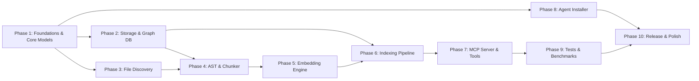

# Memex MVP Development Roadmap & Task Breakdown

**Project:** Memex (Local Offline Documentation Context Server)  
**Document:** Implementation Phases & Granular Task Breakdown  
**Target:** Engineering Team  
**Reference Architecture:** [docs/architecture.md](architecture.md)

---

## Overview & Execution Strategy

This document outlines the systematic, step-by-step implementation plan for delivering the **Memex MVP**. Tasks are scoped to be granular, self-contained, and testable, minimizing cognitive overhead and avoiding overly broad implementation steps.

---

## Phase 1: Foundations, Domain Models & Error Handling

Establish the core repository structure, domain structs, error handling, and project configuration module.

### Tasks

- [x] **TASK-1.1: Module Directory Scaffolding**
  - **Description:** Create the directory and file structure matching Section 3 of `architecture.md` (`src/cli/`, `src/ingestion/`, `src/storage/`, `src/mcp/`, `src/discovery/`, `src/installer/`).
  - **Deliverable:** Stub `mod.rs` files for all submodules registered in `src/main.rs`.
  - **Verification:** `cargo check` passes without missing module errors.

- [x] **TASK-1.2: Core Domain Models Implementation**
  - **Description:** Implement `src/models.rs` defining `Document`, `Chunk`, `ChunkType`, `Edge`, and `EdgeType` with full `serde::{Serialize, Deserialize}`, `Debug`, `Clone`, and `PartialEq` derives.
  - **Deliverable:** `src/models.rs` fully typed with doc comments.
  - **Verification:** Unit tests verifying JSON serialization and deserialization roundtrip for all model variants.

- [x] **TASK-1.3: Error Type Hierarchy (`src/errors.rs`)**
  - **Description:** Expand `src/errors.rs` with `thiserror::Error` enum variants covering CLI, discovery, parsing, embedding, storage, MCP protocol, and configuration errors.
  - **Deliverable:** `MemexError` with formatted error messages and `From` conversions for `rusqlite::Error`, `std::io::Error`, `serde_json::Error`, etc.
  - **Verification:** Unit tests verifying error formatting and error conversions.

- [x] **TASK-1.4: Project Configuration Parser (`src/config.rs`)**
  - **Description:** Implement `MemexConfig` parser reading optional `memex.json` from project root with `exclude: Vec<String>` and `include: Vec<String>` fields. Gracefully handle missing/malformed config by returning defaults.
  - **Deliverable:** `src/config.rs` with `MemexConfig::load_or_default(root: &Path) -> MemexConfig`.
  - **Verification:** Unit tests verifying: (1) valid JSON parsing, (2) missing file returns defaults, (3) malformed JSON warns and returns defaults.

---

## Phase 2: Storage & Database Layer (`src/storage/`)

Implement the SQLite relational schema, WAL configuration, `sqlite-vec` virtual tables, transactional writers, and graph traversal queries.

### Tasks

- [x] **TASK-2.1: SQLite Connection & Pragmas Setup (`src/storage/db.rs`)**
  - **Description:** Implement connection helper establishing connections with `PRAGMA journal_mode = WAL`, `PRAGMA synchronous = NORMAL`, `PRAGMA foreign_keys = ON`, and `PRAGMA cache_size = -64000`. Provide read-write and read-only connection openers.
  - **Deliverable:** `Database::open(path: &Path) -> Result<Database>` and `Database::open_readonly(path: &Path) -> Result<Database>`.
  - **Verification:** Unit test asserting PRAGMA values on an in-memory or temp SQLite connection.

- [x] **TASK-2.2: Database Schema & Migrations (`src/storage/schema.rs`)**
  - **Description:** Write schema initialization executing `CREATE TABLE IF NOT EXISTS` for `documents`, `chunks`, `edges`, indices (`idx_chunks_doc`, `idx_chunks_parent`, `idx_edges_target`, etc.), and `CREATE VIRTUAL TABLE IF NOT EXISTS vec_chunks USING vec0(...)`.
  - **Deliverable:** `schema::initialize_schema(conn: &Connection) -> Result<()>`.
  - **Verification:** Unit test executing schema creation twice sequentially (idempotency check) and inspecting `sqlite_master`.

- [x] **TASK-2.3: sqlite-vec Extension Loading & Validation**
  - **Description:** Implement dynamic extension loading or bundled initialization for `sqlite-vec`. Provide a self-test function verifying `vec0` virtual table capability.
  - **Deliverable:** Safe wrapper loading extension on connection creation.
  - **Verification:** Unit test inserting and querying a dummy 384-dimensional float vector.

- [x] **TASK-2.4: Transactional Writer (`src/storage/writer.rs`)**
  - **Description:** Implement transactional batch operations: (1) `insert_document`, (2) `insert_chunks_batch`, (3) `insert_edges_batch`, (4) `insert_vectors_batch`, (5) `delete_document` (ensuring `ON DELETE CASCADE` clears relational and vector records).
  - **Deliverable:** `StorageWriter` methods wrapping operations in `Transaction`.
  - **Verification:** Integration test asserting cascade deletion of chunks, edges, and vectors upon document deletion.

- [x] **TASK-2.5: Relational Reader & Vector KNN Queries (`src/storage/reader.rs`)**
  - **Description:** Implement KNN vector similarity search (`SELECT chunk_id, distance FROM vec_chunks WHERE embedding MATCH ? ORDER BY distance LIMIT ?`) joined with `chunks` and `documents`.
  - **Deliverable:** `StorageReader::search_knn(embedding: &[f32], limit: usize) -> Result<Vec<SearchResult>>`.
  - **Verification:** Test inserting 10 synthetic vectors and verifying KNN search returns nearest neighbor IDs in sorted distance order.

- [x] **TASK-2.6: Graph Traversal Engine (`src/storage/reader.rs`)**
  - **Description:** Implement: (1) Upward recursive CTE walking `parent_chunk_id` up to `depth`, (2) Downward/sideways queries walking `edges` table.
  - **Deliverable:** `StorageReader::traverse_subgraph(chunk_id: &str, depth: u32) -> Result<Subgraph>`.
  - **Verification:** Test building a 3-level hierarchy (H1 -> H2 -> Paragraph) and traversing from paragraph to retrieve full heading lineage.

---

## Phase 3: File Discovery & Filtering (`src/discovery/`)

Implement directory walking, `.gitignore` parsing, custom `memex.json` rules, and root safety validation.

### Tasks

- [x] **TASK-3.1: Unsafe Root Safety Validator (`src/discovery/mod.rs`)**
  - **Description:** Implement `unsafe_index_root_reason(path: &Path) -> Option<String>` checking if path matches `$HOME`, a filesystem root (`/`, `C:\`), or parent of `$HOME`.
  - **Deliverable:** Function with tests covering paths, canonicalization, and symlinks.
  - **Verification:** Unit tests asserting refusal for home dir and acceptance for normal subdirectories.

- [x] **TASK-3.2: Recursive File Walker (`src/discovery/walker.rs`)**
  - **Description:** Implement scanner using `ignore` and `walkdir` crates finding `.md` and `.markdown` files. Built-in skips for `.git/`, `node_modules/`, `target/`, `dist/`, `.memex/`, and hidden directories.
  - **Deliverable:** `FileDiscovery::scan(root: &Path, config: &MemexConfig) -> Result<Vec<PathBuf>>`.
  - **Verification:** Unit test scanning fixture directory with mixed extensions and hidden folders.

- [x] **TASK-3.3: Gitignore & Custom Exclude / Include Integration**
  - **Description:** Ensure `ignore::WalkBuilder` correctly layers `.gitignore` rules, then applies `memex.json` `exclude` globs, then applies `memex.json` `include` overrides.
  - **Deliverable:** Integrated filter chain in `discovery/walker.rs`.
  - **Verification:** Integration test with fixture containing ignored files and custom excluded/included paths.

- [x] **TASK-3.4: Content Hash Calculation Utility**
  - **Description:** Implement fast SHA-256 computation over file contents (`SHA256(bytes)`) for incremental change detection.
  - **Deliverable:** `compute_file_hash(path: &Path) -> Result<String>`.
  - **Verification:** Unit test verifying deterministic hash matching standard `sha256sum`.

---

## Phase 4: Markdown Ingestion & Contextual Chunking (`src/ingestion/`)

Transform Markdown files into an AST, generate contextually prefixed chunks, build hierarchy edges, and resolve cross-references.

### Tasks

- [x] **TASK-4.1: Markdown Event-to-AST Parser (`src/ingestion/parser.rs`)**
  - **Description:** Build an event parser on top of `pulldown-cmark` using a heading stack to construct a structured AST (Headings H1-H6, Paragraphs, CodeBlocks with language, Lists). Track line numbers and byte offsets.
  - **Deliverable:** `MarkdownParser::parse(content: &str) -> Result<DocumentAst>`.
  - **Verification:** Unit tests verifying correct tree hierarchy on documents with H1, H2, and H3.

- [x] **TASK-4.2: Contextual Prefix Generator (`src/ingestion/chunker.rs`)**
  - **Description:** Traverse AST leaves, collect ancestor heading titles into `heading_path: Vec<String>`, and format `contextual_content` (e.g. `"[Title > Section > Subsection] Paragraph text..."`).
  - **Deliverable:** Function generating prefixed text for every leaf node.
  - **Verification:** Unit tests verifying prefix formatting matches expected heading hierarchy.

- [x] **TASK-4.3: Chunk Size Guardrail & Splitting (`src/ingestion/chunker.rs`)**
  - **Description:** Enforce maximum chunk size (~512 tokens / ~2000 chars). Split oversized paragraphs at sentence boundaries while preserving the identical `heading_path` and `parent_chunk_id`.
  - **Deliverable:** Splitter function handling large paragraphs and code blocks.
  - **Verification:** Unit test with 4000-character paragraph producing split chunks with identical heading prefixes.

- [x] **TASK-4.4: Graph Hierarchy Edge Builder (`src/ingestion/chunker.rs`)**
  - **Description:** Generate `Edge { edge_type: EdgeType::Hierarchy }` records linking parent heading chunks to child heading chunks and child content chunks.
  - **Deliverable:** Generator outputting `Vec<Edge>` for document hierarchy.
  - **Verification:** Unit test asserting correct edge count and source/target IDs in nested sections.

- [x] **TASK-4.5: Explicit Markdown Link Resolver (`src/ingestion/chunker.rs`)**
  - **Description:** Detect markdown links `[text](target)`. Resolve internal anchors (`#slug`) and cross-document links (`other.md#slug`) to target chunk IDs, creating `EdgeType::ExplicitLink` edges. Skip external HTTP/HTTPS URLs.
  - **Deliverable:** Link resolution pass in chunking pipeline.
  - **Verification:** Unit test checking explicit edges created between two linked sections.

---

## Phase 5: Local Embedding Engine (`src/ingestion/embedder.rs`)

Integrate ONNX Runtime via `ort`, handle tokenizer loading, execute batched inference, and normalize vectors.

### Tasks

- [x] **TASK-5.1: Model & Tokenizer Asset Loader (`src/ingestion/embedder.rs`)**
  - **Description:** Implement asset resolution for `all-MiniLM-L6-v2` (`model.onnx` ~80MB and `tokenizer.json`). Check `~/.cache/memex/models/`, download on first run if absent, and verify SHA-256 hash integrity.
  - **Deliverable:** `ModelManager::ensure_model_assets() -> Result<ModelAssets>`.
  - **Verification:** Unit test verifying asset cache path resolution and file integrity check.

- [x] **TASK-5.2: ONNX Runtime Session Management**
  - **Description:** Initialize `ort::Session` with optimized thread settings. Wrap session in `Arc<Session>` for thread-safe reuse across batches and MCP requests.
  - **Deliverable:** `EmbeddingEngine::new(assets: &ModelAssets) -> Result<Self>`.
  - **Verification:** Test initializing session and verifying input/output tensor shapes.

- [x] **TASK-5.3: Tokenization & Attention Mask Pipeline**
  - **Description:** Use `tokenizers` crate to tokenize text batches, apply padding to max sequence length (bounded at 256 tokens), and generate `input_ids` and `attention_mask` tensors.
  - **Deliverable:** `TokenizerWrapper::encode_batch(&[&str]) -> Result<TokenizedBatch>`.
  - **Verification:** Test tokenizing batch with variable length strings asserting matching tensor shapes.

- [x] **TASK-5.4: Batched Inference & L2 Normalization**
  - **Description:** Execute `session.run(...)` on batches of up to 64 items. Perform mean pooling over token embeddings weighted by attention mask, then apply L2 normalization to produce unit vectors (`[f32; 384]`).
  - **Deliverable:** `EmbeddingEngine::embed_batch(&self, texts: &[String]) -> Result<Vec<[f32; 384]>>`.
  - **Verification:** Unit test verifying output vectors have norm $\approx 1.0 \pm 1e-5$ and produce high dot product on semantically identical phrases.

---

## Phase 6: Indexing Pipeline & CLI Commands (`init` & `index`)

Orchestrate the ingestion, delta comparison, transaction commit, and terminal reporting.

### Tasks

- [x] **TASK-6.1: Incremental Delta Engine (`src/cli/index.rs`)**
  - **Description:** Query stored `(file_path, content_hash)` from `documents` table. Compare with current disk scan to classify files into `Added`, `Modified`, `Removed`, and `Unchanged`.
  - **Deliverable:** `DeltaClassifier::compute(scanned: &[PathBuf], db: &Database) -> Result<IndexDelta>`.
  - **Verification:** Unit tests verifying all 4 delta states with simulated disk/DB states.

- [ ] **TASK-6.2: End-to-End Document Indexing Coordinator**
  - **Description:** Coordinate parsing -> chunking -> batch embedding -> database write. Delete removed/modified records within transaction before writing new chunks and vectors.
  - **Deliverable:** `IndexCoordinator::process_delta(delta: IndexDelta, ...) -> Result<IndexStats>`.
  - **Verification:** Integration test running indexing on a directory and verifying database consistency.

- [ ] **TASK-6.3: Error Log Recorder (`.memex/errors.log`)**
  - **Description:** Capture non-fatal per-file errors (e.g. unparseable markdown, invalid encoding) without aborting the overall index. Write summary to `.memex/errors.log` and delete log if index is clean.
  - **Deliverable:** Error logging helper integrated into coordinator.
  - **Verification:** Test verifying an unreadable file is logged and remaining valid files are indexed.

- [ ] **TASK-6.4: CLI `memex init` Command Implementation (`src/cli/init.rs`)**
  - **Description:** Implement `memex init [path]` handling: (1) safety checks, (2) `.memex/` directory creation, (3) database schema creation, (4) full index execution, (5) formatted CLI success output.
  - **Deliverable:** CLI handler function for `Commands::Init`.
  - **Verification:** End-to-end test running `memex init` on a temporary project directory.

- [ ] **TASK-6.5: CLI `memex index` Command Implementation (`src/cli/index.rs`)**
  - **Description:** Implement `memex index [path]` handling: (1) find nearest `.memex/` parent root, (2) run incremental delta indexing, (3) respect `--quiet` flag, (4) format CLI stats output.
  - **Deliverable:** CLI handler function for `Commands::Index`.
  - **Verification:** Test running `index` twice, verifying 0 changes on second run ("Already up to date").

---

## Phase 7: MCP Server & Tools (`src/mcp/` & `src/cli/serve.rs`)

Implement stdio JSON-RPC 2.0 transport, tool definitions, request routing, and query execution.

### Tasks

- [ ] **TASK-7.1: MCP JSON-RPC Stdio Framing & Transport (`src/mcp/transport.rs`)**
  - **Description:** Implement asynchronous line-delimited JSON-RPC 2.0 stdio read/write loop. Enforce strict discipline: all tracing/logging goes to `stderr`, `stdout` carries only valid JSON-RPC lines.
  - **Deliverable:** `McpTransport::listen<H: RequestHandler>(handler: H) -> Result<()>`.
  - **Verification:** Unit test asserting JSON-RPC frame serialization and deserialization.

- [ ] **TASK-7.2: MCP Protocol Handshake & Tool Schemas (`src/mcp/types.rs`)**
  - **Description:** Implement handlers for `initialize`, `notifications/initialized`, and `tools/list`, returning tool definitions and JSON schemas for `search_documentation` and `traverse_graph`.
  - **Deliverable:** Schema descriptors matching Section 7 of `architecture.md`.
  - **Verification:** Unit test validating generated tool schema against standard MCP specs.

- [ ] **TASK-7.3: Tool Handler: `search_documentation` (`src/mcp/tools.rs`)**
  - **Description:** Implement tool handler: (1) validate query parameters, (2) embed query with `EmbeddingEngine`, (3) execute KNN search in `StorageReader`, (4) format markdown response with file paths, heading breadcrumbs, line numbers, and similarity score.
  - **Deliverable:** Tool execution function for `search_documentation`.
  - **Verification:** Integration test calling search on indexed test fixture and verifying structured output.

- [ ] **TASK-7.4: Tool Handler: `traverse_graph` (`src/mcp/tools.rs`)**
  - **Description:** Implement tool handler: (1) fetch chunk by ID, (2) traverse upward ancestors via recursive CTE, (3) fetch downward/explicit edges, (4) format hierarchical context markdown.
  - **Deliverable:** Tool execution function for `traverse_graph`.
  - **Verification:** Integration test requesting traversal of nested section chunk ID.

- [ ] **TASK-7.5: CLI `memex serve --mcp` Command (`src/cli/serve.rs`)**
  - **Description:** Implement `memex serve --mcp`: (1) resolve project root, (2) open database in read-only mode (`SQLITE_OPEN_READ_ONLY`), (3) initialize embedding engine, (4) start MCP stdio server loop, (5) handle graceful shutdown on stdin EOF.
  - **Deliverable:** CLI handler function for `Commands::Serve`.
  - **Verification:** Integration test sending `initialize` and `tools/call` JSON-RPC lines via stdin pipe and checking stdout output.

---

## Phase 8: Agent Auto-Installer (`src/installer/` & `src/cli/install.rs`)

Implement interactive and automated agent configuration injection for Claude Code, Cursor, and Antigravity IDE.

### Tasks

- [ ] **TASK-8.1: Atomic File Mutation Helper (`src/installer/config_writer.rs`)**
  - **Description:** Implement `atomic_write_json(path: &Path, data: &Value) -> Result<()>` writing to `<path>.tmp.<pid>` then renaming. If existing file is invalid JSON, back it up to `<path>.backup` before rewriting.
  - **Deliverable:** File helper utility with unit tests.
  - **Verification:** Unit test testing atomic replacement and backup creation on corrupted input.

- [ ] **TASK-8.2: Agent Target Trait & Registry (`src/installer/targets/mod.rs`)**
  - **Description:** Define `AgentTarget` trait with methods: `id()`, `name()`, `detect() -> DetectionResult`, `install(options) -> Result<()>`. Implement target registry detecting installed coding agents.
  - **Deliverable:** Trait and registry module in `src/installer/targets/`.
  - **Verification:** Unit test detecting simulated agent configs in temporary home directory.

- [ ] **TASK-8.3: Claude Code Installer Target (`src/installer/targets/claude.rs`)**
  - **Description:** Implement Claude Code target:
    1. Write MCP server entry `{"mcpServers": {"memex": {"type": "stdio", "command": "memex", "args": ["serve", "--mcp"]}}}` into `~/.claude.json` (global) or `.mcp.json` (local).
    2. Write permissions `{"permissions": {"allow": ["mcp__memex__*"]}}` into `~/.claude/settings.json`.
  - **Deliverable:** `ClaudeTarget` implementation.
  - **Verification:** Test verifying correct JSON merging and permission entry injection.

- [ ] **TASK-8.4: Cursor & Antigravity IDE Targets (`src/installer/targets/`)**
  - **Description:** Implement targets for Cursor (`~/.cursor/mcp.json`) and Antigravity IDE (`~/.gemini/antigravity-ide/mcp/`).
  - **Deliverable:** `CursorTarget` and `AntigravityTarget` structs.
  - **Verification:** Test verifying MCP config generation for both targets.

- [ ] **TASK-8.5: CLI `memex install` Command (`src/cli/install.rs`)**
  - **Description:** Implement `memex install` with interactive terminal prompts (or `--yes` non-interactive flag with `--target <ids>`).
  - **Deliverable:** CLI handler function for `Commands::Install`.
  - **Verification:** Test running `memex install --yes --target claude` in test environment.

---

## Phase 9: Test Suite, Benchmarks & Efficiency Validation Gate

Build fixture corpus, unit/integration suites, Criterion benchmarks, and CI efficiency verification gate.

### Tasks

- [ ] **TASK-9.1: Test Fixture Corpus Setup (`tests/fixtures/`)**
  - **Description:** Create static test fixtures matching Section 13.1 of `architecture.md`:
    - `simple/`: 3-5 Markdown files with basic headings.
    - `complex/`: 20+ nested files with cross-links and `.gitignore`.
    - `edge_cases/`: empty file, heading-only, deeply nested (H1-H6), unicode/emojis, large file (~1MB), broken links.
  - **Deliverable:** Fixtures directory committed in `tests/fixtures/`.
  - **Verification:** Unit tests reading and validating all fixture files.

- [ ] **TASK-9.2: Synthetic Corpus Generator (`benches/generate_corpus.rs`)**
  - **Description:** Create benchmark generator creating medium (~500KB, 50 files) and large (~5MB, 200 files) documentation trees with realistic heading hierarchies, code snippets, and cross-links.
  - **Deliverable:** Reusable test utility for benchmark generation.
  - **Verification:** Run generator in temp dir and assert file/directory counts.

- [ ] **TASK-9.3: Integration Test Suite (`tests/integration/`)**
  - **Description:** Implement test files matching Section 13.3:
    - `test_index_pipeline.rs`: Full index, database content verification.
    - `test_incremental_index.rs`: Adding, modifying, deleting files.
    - `test_mcp_tools.rs`: Full query and traversal roundtrip.
  - **Deliverable:** Integration test suite executed via `cargo test --test '*'`.
  - **Verification:** `cargo test --test '*'` passes 100%.

- [ ] **TASK-9.4: Criterion Performance Benchmarks (`benches/`)**
  - **Description:** Implement Criterion benchmarks matching Section 13.4:
    - `bench_ingestion.rs`: Indexing throughput (medium < 5s, incremental < 1s).
    - `bench_query.rs`: MCP search latency (< 50ms) and traverse latency (< 10ms).
  - **Deliverable:** Benchmark suite run via `cargo bench`.
  - **Verification:** `cargo bench --no-run` compiles and runs successfully.

- [ ] **TASK-9.5: CI Token Reduction Efficiency Gate (`tests/test_token_reduction_gate.rs`)**
  - **Description:** Implement `gate_token_reduction_minimum_70_percent` test using `tiktoken-rs` comparing naive full-file token counts vs `search_documentation` output. Gate fails build if reduction < 70%.
  - **Deliverable:** CI gate test matching Section 13.5.1 of `architecture.md`.
  - **Verification:** Run `cargo test --test test_token_reduction_gate -- --ignored` and assert token reduction $\ge 70\%$.

---

## Phase 10: Polishing, Packaging & Release Verification

Optimize binary size, finalize Makefile/CI workflows, and perform end-to-end user testing.

### Tasks

- [ ] **TASK-10.1: Cargo Release Profile & Binary Optimization**
  - **Description:** Configure `Cargo.toml` `[profile.release]` with `lto = "thin"`, `codegen-units = 1`, `opt-level = 3`, and `strip = true` to minimize binary footprint.
  - **Deliverable:** Optimized release profile in `Cargo.toml`.
  - **Verification:** `cargo build --release` produces standalone stripped binary.

- [ ] **TASK-10.2: Makefile & Developer Workflow Verification**
  - **Description:** Verify all Makefile targets work cleanly: `make check`, `make test`, `make bench`, `make fmt-check`, `make clippy`.
  - **Deliverable:** Fully functional `Makefile`.
  - **Verification:** Execute all Makefile targets in sequence.

- [ ] **TASK-10.3: Git Hooks Sync Script Helper**
  - **Description:** Provide optional Git hook installation snippet (`post-commit`, `post-merge`, `post-checkout`) triggering `(memex index >/dev/null 2>&1 &)` in the background.
  - **Deliverable:** Documentation and hook installer helper.
  - **Verification:** Test running git commit and observing index refresh.

- [ ] **TASK-10.4: End-to-End Real World Validation**
  - **Description:** Test Memex on a real open-source documentation repo (e.g. Memex's own `docs/` folder): run `memex init`, start `memex serve --mcp`, query via test client, verify results relevance and latency.
  - **Deliverable:** End-to-end verification checklist report.
  - **Verification:** Validate that search queries return accurate documentation excerpts under 30ms.

---

## Task Progress Summary Table

| Phase | Description | Task Count | Status |
| :--- | :--- | :---: | :---: |
| **Phase 1** | Foundations, Domain Models & Error Handling | 4 | Completed (4/4) |
| **Phase 2** | Storage & Database Layer (`src/storage/`) | 6 | In Progress (2/6) |
| **Phase 3** | File Discovery & Filtering (`src/discovery/`) | 4 | Pending |
| **Phase 4** | Markdown Ingestion & Contextual Chunking (`src/ingestion/`) | 5 | Pending |
| **Phase 5** | Local Embedding Engine (`src/ingestion/embedder.rs`) | 4 | Pending |
| **Phase 6** | Indexing Pipeline & CLI Commands (`init`, `index`) | 5 | Pending |
| **Phase 7** | MCP Server & Tools (`src/mcp/`, `serve`) | 5 | Pending |
| **Phase 8** | Agent Auto-Installer (`src/installer/`, `install`) | 5 | Pending |
| **Phase 9** | Test Suite, Benchmarks & Efficiency Gate | 5 | Pending |
| **Phase 10** | Polishing, Packaging & Release Verification | 4 | Pending |
| **Total** | **Full MVP Scope** | **47 Tasks** | **6 / 47 Completed** |
